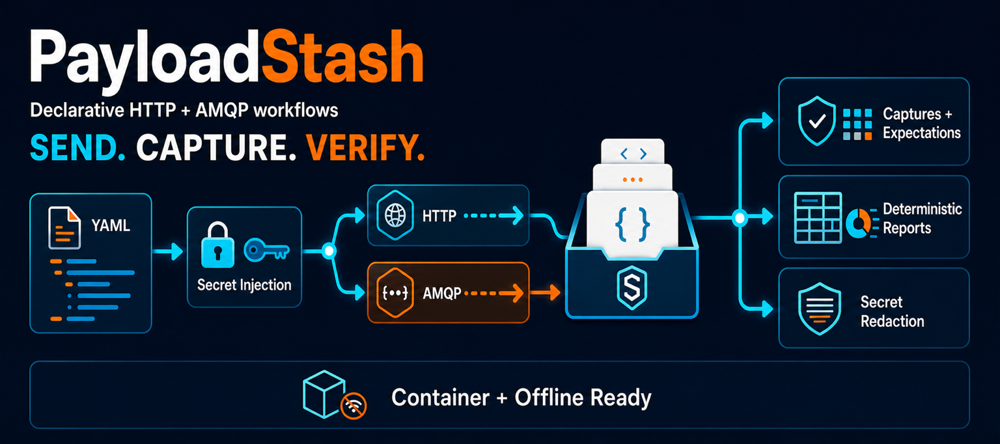

# PayloadStash



PayloadStash is a YAML-driven HTTP and AMQP request runner that captures responses, evaluates expectations, and writes deterministic run artifacts.

## User documentation

**Installing, configuring, and operating PayloadStash:**

[:book: Open the PayloadStash user guide](https://ericwastaken.github.io/PayloadStash/)

The GitHub Pages guide is the source of truth for end users, including local/bootstrap, cloned UV, Git-based UV tool, and GHCR Docker installations. User configuration, CLI, examples, output, and troubleshooting details live there rather than in repository READMEs.

## Source development

### UV workflow

```bash
uv sync
uv run payloadstash --help
```

UV uses `pyproject.toml` and `uv.lock` to create the project environment. Run the CLI directly from the checkout with `uv run payloadstash ...`.

### Bootstrap editable workflow

```bash
python3 bootstrap.py --editable
./payloadstash --help
```

`bootstrap.py` creates a repository-local `.venv`. Editable installs normally need reinstalling only when dependencies or console entry points change.

## Tests

The current test suite uses executable Python scripts rather than a test-runner dependency:

```bash
uv run python tests/test_asserts.py
uv run python tests/test_header_case.py
uv run python tests/test_url_operators.py
uv run python tests/test_amqp.py
```

The AMQP integration harness under `amqp-test/` uses Docker Compose and a real RabbitMQ broker; see [`amqp-test/README.md`](./amqp-test/README.md).

Documentation changes are validated separately:

```bash
python3 -m venv .venv-docs
.venv-docs/bin/python -m pip install -r docs/requirements.txt
.venv-docs/bin/mkdocs build --strict
```

### GitHub Pages maintenance

`.github/workflows/docs.yml` strictly builds documentation pull requests and deploys the `site/` artifact after qualifying pushes to `main`. Generated HTML is never committed.

Before the first deployment, a repository administrator must open **Settings → Pages** and select **GitHub Actions** as the Pages source. The workflow handles later deployments; no `gh-pages` branch is used.

## Architecture

- `payload_stash/main.py` defines the Click CLI and orchestrates validation, execution, and artifact generation.
- `payload_stash/config_schema.py` contains Pydantic configuration models and resolution rules.
- `payload_stash/config_utility.py` resolves operators, captures, JSONPath, and expectations.
- `payload_stash/request_manager.py` performs HTTP work and retry handling.
- `payload_stash/amqp_manager.py` performs AMQP publishing, confirms, TLS, RPC, and subscription waits.
- `config/config-example.yml` is the canonical executable example.
- `docs/` is the sole source for end-user documentation; `mkdocs.yml` defines the published site.

Requests in each sequence execute sequentially or through a bounded concurrent worker pool. Resolution applies YAML parsing, defaults/request/forced precedence, dynamic operators, and secret redaction before transport dispatch. Each run writes a resolved configuration, CSV results, detailed log, Markdown report, and response bodies.

## Build and release entry points

| Command | Purpose |
| --- | --- |
| `./x-python-package-payloadstash.sh` | Build the portable Python distribution archive |
| `./x-docker-build-payloadstash.sh` | Build the local container image |
| `./x-docker-package-payloadstash.sh` | Build the air-gapped Docker distribution archive |
| `./x-payloadstash-version-set.sh` | Update project version metadata |

Artifact-production notes remain in [`packaged-python/README - Python Version.md`](./packaged-python/README%20-%20Python%20Version.md) and [`packaged-docker/README - Docker Version.md`](./packaged-docker/README%20-%20Docker%20Version.md). The existing container publication workflow pushes `ghcr.io/ericwastaken/payloadstash` independently of documentation deployment.

## Repository documentation

- [Release notes](./RELEASE-NOTES-v1.0.0.md)
- [Configuration sample maintenance](./config/README.md)
- [Agent documentation ownership rules](./AGENT.MD)
- [License](./LICENSE)